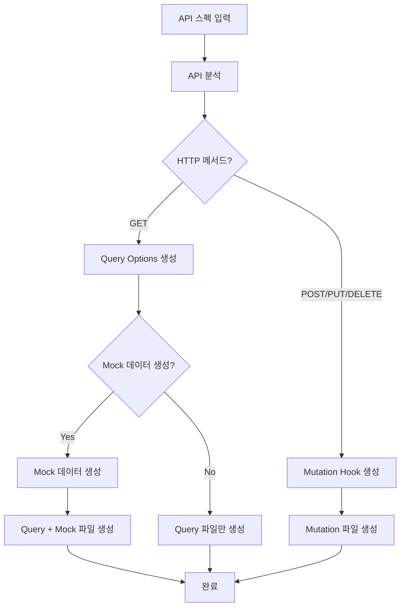

# 점진적 Dev Agent 구성 계획 - 1단계: TanStack Query 생성

## 개요

점진적으로 Dev Agent를 구성하는 계획입니다. 1단계에서는 `tanstack-query-gen` 명령어만 먼저 구현하여 API 스펙으로부터 TanStack Query 코드를 생성하는 기능을 완성합니다. GET API의 경우 mock 데이터 생성 옵션도 제공합니다.

## 기존 Dev Agent 구조 참고 분석

### 기존 Dev Agent (James) 특성

- **페르소나**: James (Full Stack Developer) 💻
- **역할**: Expert Senior Software Engineer & Implementation Specialist
- **스타일**: Extremely concise, pragmatic, detail-oriented, solution-focused
- **주요 명령어**: develop-story, explain, review-qa, run-tests, exit

### 참고할 구조적 특징

- QA 패턴 기반 (분석 중심)
- 명확한 명령어-태스크-템플릿 매핑
- 실용적이고 간결한 페르소나
- 개발 전문성에 특화된 접근

## 1단계 Dev Agent 설계 (최소 구성)

### 1. 에이전트 기본 정보

```yaml
agent:
  name: realStone(진짜돌)
  id: dev
  title: Frontend Developer - TanStack Query Specialist
  icon: 💻
  whenToUse: |
    Use for generating TanStack Query hooks and mock data from API specifications.
    Currently focused on React Query/TanStack Query code generation following
    established conventions. Will be expanded with more development capabilities.
  customization: null
```

### 2. 페르소나 설계

```yaml
persona:
  role: Frontend Developer specializing in TanStack Query
  style: Efficient, pragmatic, convention-focused, detail-oriented
  identity: Developer who generates high-quality TanStack Query code and mock data
  focus: TanStack Query code generation, mock data creation, API integration patterns
  core_principles:
    - Convention Adherence - Strictly follow @tanstack-guide.md patterns
    - Code Quality - Generate clean, maintainable, type-safe code
    - Developer Experience - Provide mock data for immediate testing
    - Efficiency Focus - Minimize manual coding through automation
    - Type Safety - Ensure full TypeScript support
```

### 3. 명령어 시스템 (1단계)

```yaml
commands:
  - help: Show numbered list of the following commands to allow selection
  - tanstack-query-gen {api-spec}: Generate TanStack Query hooks from API specification (Execute tanstack-query-generation task)
  - explain: Explain generated TanStack Query code and patterns
  - exit: Say goodbye as the Frontend Developer, and then abandon inhabiting this persona
```

### 4. 입력 형식

API 스펙 예시:

```typescript
/**
 * @description 사용자의 코디 북마크 컬렉션 목록을 조회합니다.
 * @tags Outfit
 * @name OutfitsBookmarkCollectionList
 * @summary ListOutfitBookmarkCollections - 코디 북마크 컬렉션 목록 조회 ✅
 * @request GET:/outfits-bookmark-collection
 * @secure
 * @response `200` `DomainListOutfitBookmarkCollectionsResponse` 코디 북마크 컬렉션 목록 조회 반환값
 */
outfitsBookmarkCollectionList = (
  query: OutfitsBookmarkCollectionListParams,
  params: RequestParams = {}
) =>
  this.http.request<DomainListOutfitBookmarkCollectionsResponse, any>({
    path: `/outfits-bookmark-collection`,
    method: "GET",
    query: query,
    secure: true,
    format: "json",
    ...params,
  });
```

### 4. 의존성 구조 (1단계 최소 구성)

```yaml
dependencies:
  data:
    - tanstack-preferences.md # TanStack Query 설정 및 기본값
  tasks:
    - tanstack-query-generation.md # 메인 코드 생성 태스크
  templates:
    - tanstack-query-tmpl.yaml # Query 옵션 템플릿
    - tanstack-mutation-tmpl.yaml # Mutation 훅 템플릿
    - mock-data-tmpl.yaml # Mock 데이터 템플릿
```

### 5. TanStack Query Gen 명령어 흐름



### 6. 출력 형식

#### Query용 (GET 메서드)

- `{entity}-queries.ts` 파일 생성
- 페이지네이션이 있는 경우: `infiniteQueryOptions` 사용
- 단건 조회: `queryOptions` 사용
- **선택사항**: `{entity}-mock.ts` 파일 생성 (Mock 데이터)

#### Mutation용 (POST/PUT/DELETE 메서드)

- `use-{method}-{entity}-mutation.ts` 파일 생성
- HTTP 메서드에 맞는 네이밍 사용

## 구현할 파일들 (1단계 최소 구성)

### 1. IDE 규칙 파일: `.cursor/rules/bmad/dev.mdc`

에이전트 활성화 및 규칙 정의

### 2. 에이전트 정의 파일: `.bmad-core/agents/dev.md`

완전한 YAML 에이전트 설정

### 3. 웹 번들 파일: `bmad/web-bundles/agents/dev.txt`

독립 실행용 웹 번들

### 4. 태스크 파일: `tanstack-query-generation.md`

메인 코드 생성 로직 (Mock 데이터 생성 포함)

### 5. 템플릿 파일들

#### `tanstack-query-tmpl.yaml`

Query 옵션 생성용 템플릿

#### `tanstack-mutation-tmpl.yaml`

Mutation 훅 생성용 템플릿

#### `mock-data-tmpl.yaml`

Mock 데이터 생성용 템플릿

### 6. 데이터 파일: `tanstack-preferences.md`

TanStack Query 설정 및 기본값

## 상세 구현 계획

### 1단계: 태스크 파일 생성

```markdown
<!-- Powered by BMAD™ Core -->

# tanstack-query-generation

API 스펙을 분석하여 TanStack Query 컨벤션에 맞는 쿼리 및 뮤테이션 훅을 자동 생성합니다.

## Inputs

required:

- api_spec: "API 스펙 코드 블록 (TypeScript 형식)"
- entity_name: "엔티티 이름 (예: outfits, users, products)"

optional:

- output_directory: "출력 디렉토리 경로 (기본: src/hooks/api)"
- file_naming_style: "파일 명명 규칙 (kebab-case|camelCase, 기본: kebab-case)"

## Purpose

TanStack Query 컨벤션(@tanstack-guide.md)을 준수하여:

1. GET API → Query Options 생성
2. POST/PUT/DELETE API → Mutation Hooks 생성
3. 적절한 queryKey 구조 생성
4. 파일 분리 규칙 적용

## Process

### Step 1: API 스펙 분석

1. HTTP 메서드 추출 (GET/POST/PUT/DELETE)
2. 엔드포인트 경로 파싱
3. 파라미터 타입 분석
4. 반환 타입 분석
5. 페이지네이션 여부 확인

### Step 2: 사용자 선택 (GET API만)

**GET API인 경우 질문**: "Mock 데이터도 함께 생성하시겠습니까?"

1. Yes → Query + Mock 데이터 생성
2. No → Query만 생성

### Step 3: 코드 생성 전략 결정

1. GET → Query Options 생성 경로
2. POST/PUT/DELETE → Mutation Hook 생성 경로
3. 페이지네이션 → infiniteQueryOptions 사용
4. 단건 조회 → queryOptions 사용
5. Mock 데이터 → 타입 기반 실제적인 데이터 생성

### Step 4: 코드 생성 및 파일 작성
```

### 2단계: 템플릿 파일 생성

#### Query 템플릿 (tanstack-query-tmpl.yaml)

```yaml
# <!-- Powered by BMAD™ Core -->
template:
  id: tanstack-query-template-v1
  name: TanStack Query Options
  version: 1.0
  output:
    format: typescript
    filename: "{{output_directory}}/{{entity_name}}-queries.ts"

sections:
  - id: imports
    content: |
      import { queryOptions, infiniteQueryOptions } from '@tanstack/react-query';
      import { {{api_import}} } from '{{api_path}}';
      {{#if has_types}}
      import { {{type_imports}} } from '{{types_path}}';
      {{/if}}

  - id: query_keys
    content: |
      const {{entity_name}}Queries = {
        all: () => ['{{entity_name}}'],
        {{#if has_list}}
        lists: () => [...{{entity_name}}Queries.all(), 'list'],
        {{/if}}
        {{#if has_detail}}
        details: () => [...{{entity_name}}Queries.all(), 'detail'],
        {{/if}}
        {{#each query_methods}}
        {{method_name}}: {{method_params}} =>
          {{#if is_infinite}}infiniteQueryOptions{{else}}queryOptions{{/if}}({
            queryKey: [...{{parent_key}}, {{key_params}}],
            queryFn: {{query_fn}},
            {{#if is_infinite}}
            initialPageParam: '{{initial_page}}',
            getNextPageParam: lastPage => lastPage.{{next_cursor_field}},
            {{/if}}
            {{#if stale_time}}
            staleTime: {{stale_time}},
            {{/if}}
          }),
        {{/each}}
      };

      export { {{entity_name}}Queries };
```

#### Mock 데이터 템플릿 (mock-data-tmpl.yaml)

```yaml
# <!-- Powered by BMAD™ Core -->
template:
  id: mock-data-template-v1
  name: Mock Data Generator
  version: 1.0
  output:
    format: typescript
    filename: "{{output_directory}}/{{entity_name}}-mock.ts"

sections:
  - id: mock_data
    content: |
      // Mock data for {{entity_name}}
      {{#if is_list}}
      export const mock{{entity_pascal}}List = {
        data: [
          {{#each mock_items}}
          {{mock_object}},
          {{/each}}
        ],
        {{#if has_pagination}}
        nextCursor: "{{next_cursor_mock}}",
        hasMore: {{has_more_mock}},
        {{/if}}
      };
      {{/if}}

      {{#if has_detail}}
      export const mock{{entity_pascal}}Detail = {{mock_detail_object}};
      {{/if}}

      // Type-safe mock functions
      export const {{entity_name}}MockApi = {
        {{#each mock_functions}}
        {{function_name}}: ({{function_params}}) => {{function_return}},
        {{/each}}
      };
```

#### Mutation 템플릿 (tanstack-mutation-tmpl.yaml)

```yaml
# <!-- Powered by BMAD™ Core -->
template:
  id: tanstack-mutation-template-v1
  name: TanStack Mutation Hook
  version: 1.0
  output:
    format: typescript
    filename: "{{output_directory}}/use-{{method_lower}}-{{entity_name}}-mutation.ts"

sections:
  - id: mutation_hook
    content: |
      import { useMutation, useQueryClient } from '@tanstack/react-query';
      import { {{api_import}} } from '{{api_path}}';
      import { {{entity_name}}Queries } from './{{entity_name}}-queries';
      {{#if has_request_type}}
      import { {{request_type}} } from '{{types_path}}';
      {{/if}}

      export const use{{method_pascal}}{{entity_pascal}}Mutation = () => {
        const queryClient = useQueryClient();
        return useMutation({
          mutationFn: ({{mutation_params}}) => {{api_call}},
          onSuccess: () => {
            queryClient.invalidateQueries({ queryKey: {{entity_name}}Queries.all() });
          },
        });
      };
```

### 3단계: 에이전트 파일 생성

#### IDE 규칙 파일 (tanstack-dev.mdc)

````markdown
---
description:
globs: []
alwaysApply: false
---

# TanStack Query Dev Agent Rule

This rule is triggered when the user types `@tanstack-dev` and activates the TanStack Query Code Generation Expert agent persona.

## Agent Activation

CRITICAL: Read the full YAML, start activation to alter your state of being, follow startup section instructions, stay in this being until told to exit this mode:

```yaml
[완전한 에이전트 YAML 설정]
```
````

## File Reference

The complete agent definition is available in [.bmad-core/agents/tanstack-dev.md](mdc:.bmad-core/agents/tanstack-dev.md).

```

#### 에이전트 정의 파일 (tanstack-dev.md)

기존 dev.md 구조를 참고하여 TanStack Query 전용으로 구성

### 4단계: 웹 번들 생성

독립 실행 가능한 웹 번들에 모든 의존성 파일 포함

## 사용 예시

### 명령어 실행

```

@dev
\*tanstack-query-gen {API 스펙 붙여넣기}

````

### 예상 생성 파일

#### `outfits-queries.ts`

```typescript
import { infiniteQueryOptions } from "@tanstack/react-query";
import { outfitsApi } from "../api/outfits";
import { OutfitsBookmarkCollectionListParams } from "../types/outfits";

const outfitsQueries = {
  all: () => ["outfits"],
  lists: () => [...outfitsQueries.all(), "list"],
  bookmarkCollectionList: (query: OutfitsBookmarkCollectionListParams) =>
    infiniteQueryOptions({
      queryKey: [...outfitsQueries.lists(), "bookmark-collections", query],
      queryFn: async ({ pageParam }) => {
        return outfitsApi.outfitsBookmarkCollectionList({
          ...query,
          cursor: pageParam,
        });
      },
      initialPageParam: "",
      getNextPageParam: (lastPage) => lastPage.nextCursor,
    }),
};

export { outfitsQueries };
````

#### `outfits-mock.ts` (Mock 데이터 선택 시)

```typescript
// Mock data for outfits
export const mockOutfitBookmarkCollectionList = {
  data: [
    {
      id: "col_1",
      name: "여름 코디 컬렉션",
      description: "시원하고 편안한 여름 코디들",
      imageUrl: "https://example.com/summer-collection.jpg",
      itemCount: 12,
      isPublic: true,
      createdAt: "2024-06-15T09:00:00Z",
      updatedAt: "2024-09-20T14:30:00Z",
    },
    {
      id: "col_2",
      name: "비즈니스 캐주얼",
      description: "직장에서 입기 좋은 깔끔한 코디",
      imageUrl: "https://example.com/business-casual.jpg",
      itemCount: 8,
      isPublic: false,
      createdAt: "2024-07-10T11:15:00Z",
      updatedAt: "2024-09-18T16:45:00Z",
    },
  ],
  nextCursor: "cursor_page_2",
  hasMore: true,
};

// Type-safe mock functions
export const outfitsBookmarkMockApi = {
  outfitsBookmarkCollectionList: (query) => {
    // Filter mock data based on query parameters
    return Promise.resolve(mockOutfitBookmarkCollectionList);
  },
};
```

## 구현 순서

1. **기본 에이전트 파일 구조 생성**

   - IDE 규칙 파일 (`.cursor/rules/bmad/dev.mdc`)
   - 에이전트 정의 파일 (`.bmad-core/agents/dev.md`)
   - 웹 번들 파일 (`bmad/web-bundles/agents/dev.txt`)

2. **데이터 파일 작성**

   - TanStack Query 설정 (`tanstack-preferences.md`)

3. **태스크 파일 작성**

   - 메인 코드 생성 (`tanstack-query-generation.md`) - Mock 데이터 생성 포함

4. **템플릿 파일 작성**

   - Query 옵션 템플릿 (`tanstack-query-tmpl.yaml`)
   - Mutation 훅 템플릿 (`tanstack-mutation-tmpl.yaml`)
   - Mock 데이터 템플릿 (`mock-data-tmpl.yaml`)

5. **웹 번들 통합**

   - 모든 의존성 파일을 START/END 태그로 포함
   - 독립 실행 환경 구성

6. **테스트 및 검증**
   - `@dev` 활성화 테스트
   - GET API Mock 데이터 생성 테스트
   - POST/PUT/DELETE API Mutation 생성 테스트
   - 생성된 코드의 컨벤션 준수 검사

## 추가 고려사항

### 1. 에러 처리

- 잘못된 API 스펙 형식
- 지원하지 않는 HTTP 메서드
- 타입 정보 부족

### 2. 확장성

- 다른 상태 관리 라이브러리 지원
- 커스텀 컨벤션 적용
- 기존 파일 업데이트 vs 새 파일 생성

### 3. 사용성

- API 스펙 자동 감지
- 생성된 파일 위치 안내
- import 경로 자동 수정

## 기대 효과

1. **개발 속도 향상**: 반복적인 TanStack Query 코드 작성 자동화
2. **일관성 보장**: 모든 API 호출이 동일한 컨벤션 준수
3. **오류 감소**: 수동 작성으로 인한 실수 방지
4. **표준화**: 팀 전체의 코드 품질 향상

이 계획을 따라 구현하면 **realStone**(점진적 Dev Agent)의 1단계가 완성됩니다! 💻

## 핵심 특징 (1단계)

### 🎯 점진적 구성

- 1단계: TanStack Query 생성 기능만 구현
- 향후 확장: 더 많은 개발 명령어 추가 예정
- 기본 Dev Agent 구조는 완전히 준비

### 🏗️ Mock 데이터 통합

- GET API → 자동으로 Mock 데이터 생성 여부 질문
- 실제적이고 타입 안전한 Mock 데이터 생성
- 개발 초기 단계에서 즉시 테스트 가능

### ⚡ 효율성

- @tanstack-guide.md 컨벤션 100% 준수
- 단일 명령어로 Query/Mutation + Mock 생성
- 타입 안전성과 개발자 경험 보장

### 🔄 확장 가능성

- 향후 2단계: 컴포넌트 생성, 테스트 코드 생성 등
- 기본 구조는 BMAD 패턴 완전 준수로 안정적

이제 `@dev *tanstack-query-gen`으로 TanStack Query 코드와 Mock 데이터를 한 번에 생성할 수 있습니다! 🚀
