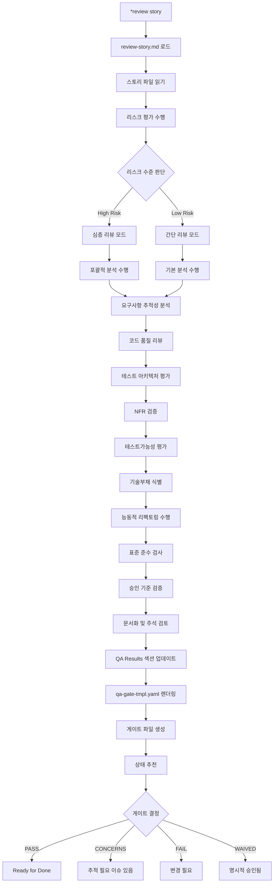
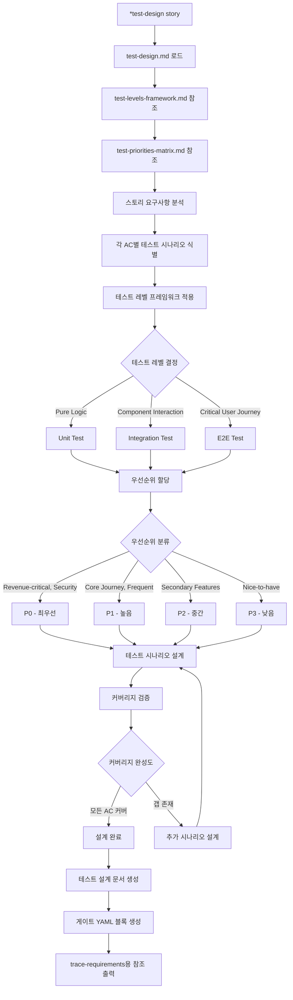
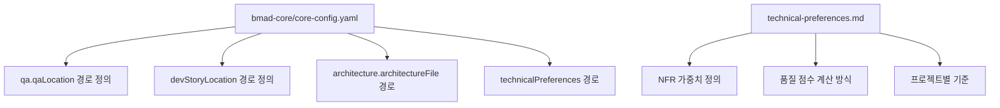
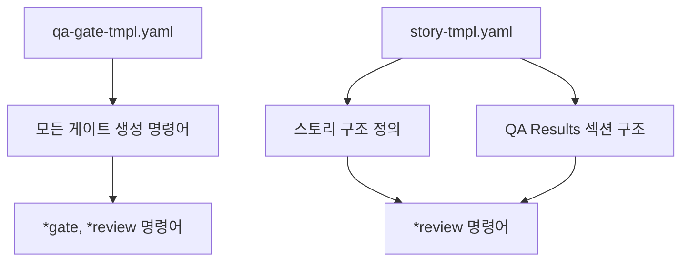
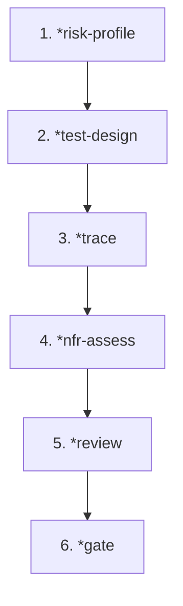

# QA 에이전트 명령어 실행 흐름도

## 개요

이 문서는 QA 에이전트의 각 명령어가 어떻게 실행되고, 어떤 파일들과 상호작용하는지를 상세히 분석한 흐름도입니다.

## 전체 명령어 실행 아키텍처

```mermaid
graph TD
    A[사용자: @qa] --> B[qa.mdc 활성화]
    B --> C[qa.md 로드]
    C --> D[Quinn 페르소나 채택]
    D --> E[bmad-core/core-config.yaml 로드]
    E --> F[*help 자동 실행]
    F --> G[명령어 대기]

    G --> H{사용자 명령어 선택}

    H -->|*gate {story}| I1[qa-gate.md 실행]
    H -->|*nfr-assess {story}| I2[nfr-assess.md 실행]
    H -->|*review {story}| I3[review-story.md 실행]
    H -->|*risk-profile {story}| I4[risk-profile.md 실행]
    H -->|*test-design {story}| I5[test-design.md 실행]
    H -->|*trace {story}| I6[trace-requirements.md 실행]

    I1 --> J1[qa-gate-tmpl.yaml 사용]
    I2 --> J2[technical-preferences.md 참조]
    I3 --> J3[qa-gate-tmpl.yaml + story-tmpl.yaml 사용]
    I4 --> J4[리스크 매트릭스 생성]
    I5 --> J5[테스트 시나리오 설계]
    I6 --> J6[Given-When-Then 매핑]

    J1 --> K1[게이트 파일 생성]
    J2 --> K2[NFR 평가 보고서 생성]
    J3 --> K3[스토리 QA Results 업데이트 + 게이트 파일]
    J4 --> K4[리스크 프로파일 보고서]
    J5 --> K5[테스트 설계 문서]
    J6 --> K6[추적성 매트릭스]
```

## 개별 명령어 상세 흐름

### 1. `*review {story}` - 포괄적 리뷰

**가장 복잡하고 중요한 명령어**



**파일 상호작용**:

- **입력**: 스토리 파일, 코드 파일들
- **참조**: `technical-preferences.md`, `core-config.yaml`
- **사용 템플릿**: `qa-gate-tmpl.yaml`, `story-tmpl.yaml`
- **출력**:
  - 스토리 파일의 QA Results 섹션 업데이트
  - `qa.qaLocation/gates/{epic}.{story}-{slug}.yml`
  - 필요시 추가 평가 보고서들

### 2. `*nfr-assess {story}` - NFR 빠른 검증

```mermaid
graph TD
    A[*nfr-assess story] --> B[nfr-assess.md 로드]
    B --> C[스토리 파일 접근 시도]
    C --> D{파일 존재?}

    D -->|Yes| E[스토리 내용 분석]
    D -->|No| F[Missing Source 처리]

    E --> G[NFR 범위 도출]
    F --> G

    G --> H{모드 선택}
    H -->|Interactive| I[사용자에게 NFR 선택 요청]
    H -->|Non-interactive| J[기본 4개 NFR 사용]

    I --> K[선택된 NFR들]
    J --> L[Security, Performance, Reliability, Maintainability]

    K --> M[임계값 확인]
    L --> M

    M --> N[아키텍처 문서 검색]
    N --> O[technical-preferences.md 확인]
    O --> P[빠른 평가 수행]

    P --> Q{각 NFR별 상태}
    Q -->|Evidence 있음| R[PASS]
    Q -->|부분적/불명확| S[CONCERNS]
    Q -->|치명적 갭| T[FAIL]

    R --> U[게이트 YAML 블록 생성]
    S --> U
    T --> U

    U --> V[품질 점수 계산]
    V --> W[간단 평가 보고서 생성]
    W --> X[qa.qaLocation/assessments/{epic}.{story}-nfr-{YYYYMMDD}.md]
    X --> Y[스토리 업데이트 라인 출력]
    Y --> Z[게이트 통합 라인 출력]
```

**결정론적 상태 규칙**:

```
quality_score = 100
- 20 for each FAIL attribute
- 10 for each CONCERNS attribute
Floor at 0, ceiling at 100
```

### 3. `*risk-profile {story}` - 리스크 평가 매트릭스

```mermaid
graph TD
    A[*risk-profile story] --> B[risk-profile.md 로드]
    B --> C[스토리 및 구현 분석]
    C --> D[리스크 카테고리별 식별]

    D --> E[TECH: 기술적 리스크]
    D --> F[SEC: 보안 리스크]
    D --> G[PERF: 성능 리스크]
    D --> H[DATA: 데이터 리스크]
    D --> I[BUS: 비즈니스 리스크]
    D --> J[OPS: 운영 리스크]

    E --> K[확률 × 영향도 평가]
    F --> K
    G --> K
    H --> K
    I --> K
    J --> K

    K --> L{리스크 점수 계산}
    L -->|9| M[Critical - 빨강]
    L -->|6| N[High - 주황]
    L -->|4| O[Medium - 노랑]
    L -->|2-3| P[Low - 초록]
    L -->|1| Q[Minimal - 파랑]

    M --> R[리스크 매트릭스 생성]
    N --> R
    O --> R
    P --> R
    Q --> R

    R --> S[완화 전략 수립]
    S --> T[테스트 요구사항 정의]
    T --> U[게이트 YAML 블록 생성]
    U --> V[마크다운 보고서 생성]
    V --> W[qa.qaLocation/assessments/{epic}.{story}-risk-{YYYYMMDD}.md]
    W --> X[리스크 기반 추천사항]
```

**리스크 점수 알고리즘**:

```
Base Score = 100
For each risk:
  - Critical (9): Deduct 20 points
  - High (6): Deduct 10 points
  - Medium (4): Deduct 5 points
  - Low (2-3): Deduct 2 points
Minimum score = 0, Maximum score = 100
```

### 4. `*test-design {story}` - 테스트 시나리오 설계



### 5. `*trace {story}` - 요구사항 추적성

```mermaid
graph TD
    A[*trace story] --> B[trace-requirements.md 로드]
    B --> C[스토리에서 테스트 가능 요구사항 추출]

    C --> D[Acceptance Criteria]
    C --> E[User Story Statement]
    C --> F[Tasks/Subtasks]
    C --> G[NFR 언급사항]
    C --> H[엣지 케이스]

    D --> I[기존 테스트 케이스 매핑]
    E --> I
    F --> I
    G --> I
    H --> I

    I --> J[Given-When-Then 문서화]
    J --> K{커버리지 레벨 평가}

    K -->|완전 테스트됨| L[full]
    K -->|일부 테스트됨| M[partial]
    K -->|테스트 없음| N[none]
    K -->|통합 테스트만| O[integration]
    K -->|유닛 테스트만| P[unit]

    L --> Q[커버리지 갭 식별]
    M --> Q
    N --> Q
    O --> Q
    P --> Q

    Q --> R[갭별 심각도 평가]
    R --> S[제안 테스트 정의]
    S --> T[게이트 YAML 블록 생성]
    T --> U[추적성 보고서 생성]
    U --> V[qa.qaLocation/assessments/{epic}.{story}-trace-{YYYYMMDD}.md]
    V --> W[리스크 평가 연결]
```

### 6. `*gate {story}` - 품질 게이트 결정

```mermaid
graph TD
    A[*gate story] --> B[qa-gate.md 로드]
    B --> C[기존 리뷰 결과 확인]
    C --> D[qa-gate-tmpl.yaml 로드]

    D --> E{게이트 결정 기준 적용}

    E --> F[리스크 임계값 확인]
    F --> G[테스트 커버리지 갭 확인]
    G --> H[이슈 심각도 확인]
    H --> I[NFR 상태 확인]

    I --> J{결정론적 규칙 적용}

    J -->|리스크 점수 ≥ 9| K[FAIL]
    J -->|리스크 점수 ≥ 6| L[CONCERNS]
    J -->|P0 테스트 누락| M[CONCERNS/FAIL]
    J -->|high severity 이슈| N[FAIL]
    J -->|medium severity 이슈| O[CONCERNS]
    J -->|NFR FAIL 상태| P[FAIL]
    J -->|NFR CONCERNS 상태| Q[CONCERNS]
    J -->|모든 조건 통과| R[PASS]
    J -->|명시적 승인| S[WAIVED]

    K --> T[게이트 파일 생성]
    L --> T
    M --> T
    N --> T
    O --> T
    P --> T
    Q --> T
    R --> T
    S --> T

    T --> U[qa.qaLocation/gates/{epic}.{story}-{slug}.yml]
    U --> V[스토리 QA Results 업데이트]
```

**게이트 결정 우선순위**:

1. 리스크 임계값 (≥9 → FAIL, ≥6 → CONCERNS)
2. 테스트 커버리지 갭 (P0 누락 → CONCERNS/FAIL)
3. 이슈 심각도 (high → FAIL, medium → CONCERNS)
4. NFR 상태 (FAIL → FAIL, CONCERNS → CONCERNS)
5. 기본값 → PASS

## 파일 간 상호 의존성

### 1. 핵심 설정 파일들



### 2. 템플릿 의존성



### 3. 출력 파일 위치 체계

```
qa.qaLocation/
├── gates/
│   └── {epic}.{story}-{slug}.yml          # 게이트 결정 파일
├── assessments/
│   ├── {epic}.{story}-nfr-{YYYYMMDD}.md   # NFR 평가
│   ├── {epic}.{story}-risk-{YYYYMMDD}.md  # 리스크 프로파일
│   ├── {epic}.{story}-test-design-{YYYYMMDD}.md  # 테스트 설계
│   └── {epic}.{story}-trace-{YYYYMMDD}.md # 추적성 매트릭스
└── docs/
    └── stories/
        └── {epic}.{story}.{title}.md      # 스토리 파일 (QA Results 섹션)
```

## 명령어 실행 순서 권장사항

### 1. 독립 실행 가능한 명령어

- `*nfr-assess` - NFR 빠른 검증
- `*risk-profile` - 리스크 분석
- `*test-design` - 테스트 설계
- `*gate` - 게이트 결정 (기존 리뷰 결과 기반)

### 2. 연계 실행 권장 순서



**이유**:

1. `risk-profile` → 리스크 기반 테스트 우선순위 제공
2. `test-design` → 테스트 시나리오 설계, trace에서 참조
3. `trace` → 요구사항-테스트 매핑, 커버리지 갭 식별
4. `nfr-assess` → NFR 빠른 검증
5. `review` → 모든 정보를 종합한 포괄적 리뷰
6. `gate` → 최종 품질 게이트 결정

### 3. `*review` 명령어의 특별함

`*review`는 다른 모든 명령어의 기능을 포함하는 **메가 명령어**입니다:

- 자체적으로 리스크 평가 수행
- NFR 검증 포함
- 테스트 아키텍처 평가
- 요구사항 추적성 확인
- 최종 게이트 결정까지 모두 처리

따라서 **단일 명령어로 완전한 QA 프로세스**를 원한다면 `*review`만 실행하면 됩니다.

## 결론

QA 에이전트의 명령어 시스템은 다음과 같은 특징을 가집니다:

1. **모듈화된 기능**: 각 명령어는 독립적으로 실행 가능
2. **연계 실행 최적화**: 순서대로 실행시 상호 참조 및 강화
3. **메가 명령어**: `*review`는 모든 기능을 통합한 완전한 워크플로우
4. **결정론적 규칙**: 명확한 기준에 따른 일관된 결과
5. **파일 기반 추적성**: 모든 결과물이 파일로 저장되어 추적 가능
6. **유연한 설정**: `technical-preferences.md`를 통한 프로젝트별 커스터마이징
